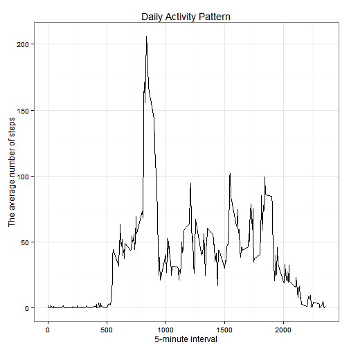
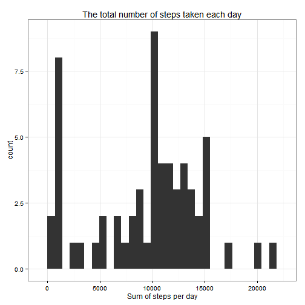
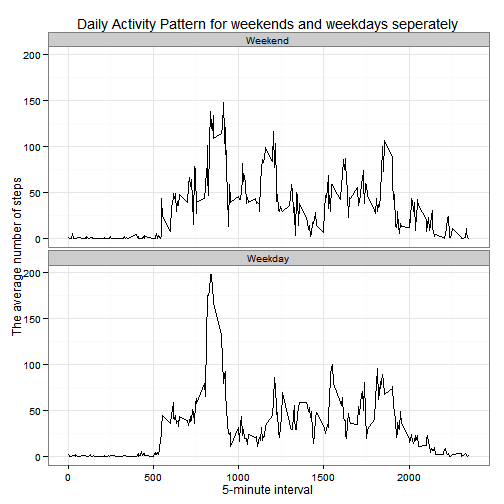

This is a R Markdown document to guide you through the analysis of personal movement activity data as a subject of the reproducible research course assignment. Please see the [README.md](https://github.com/vardakism/RepData_PeerAssessment1/blob/master/README.md) for any further information.


```r
# set global chunk options: 
library(knitr)
opts_chunk$set(cache=TRUE,cache.path = 'PA1_template_cache/', fig.path='figure/')
```
### Step1: Loading and Processing the data
In this step data are imported in R.


```r
#Load the data and note the missing values
actv<-read.csv("activity.csv",header=TRUE,sep=",")
summary(actv)
```

```
##      steps               date          interval   
##  Min.   :  0.0   2012-10-01:  288   Min.   :   0  
##  1st Qu.:  0.0   2012-10-02:  288   1st Qu.: 589  
##  Median :  0.0   2012-10-03:  288   Median :1178  
##  Mean   : 37.4   2012-10-04:  288   Mean   :1178  
##  3rd Qu.: 12.0   2012-10-05:  288   3rd Qu.:1766  
##  Max.   :806.0   2012-10-06:  288   Max.   :2355  
##  NA's   :2304    (Other)   :15840
```

```r
# Format the date with POSIXct
# This convertion is required in a following step
datc<-as.character(actv$date)
actv$daten <- as.POSIXct( strptime(datc, "%Y-%m-%d"))  
# Format it as weekdays too
actv$days<-weekdays(as.Date(actv$daten))
# Classify the days in weekend days and week days (working days)
actv$wnd<-0
actv$wnd[actv$days %in% c('Saturday','Sunday')]<-1
actv$wnd<-factor(actv$wnd,levels=c(1,0),labels=c("Weekend","Weekday") )

# Subset data without NAs
actvna<-actv[!is.na(actv$steps),]
summary(actvna)
```

```
##      steps               date          interval   
##  Min.   :  0.0   2012-10-02:  288   Min.   :   0  
##  1st Qu.:  0.0   2012-10-03:  288   1st Qu.: 589  
##  Median :  0.0   2012-10-04:  288   Median :1178  
##  Mean   : 37.4   2012-10-05:  288   Mean   :1178  
##  3rd Qu.: 12.0   2012-10-06:  288   3rd Qu.:1766  
##  Max.   :806.0   2012-10-07:  288   Max.   :2355  
##                  (Other)   :13536                 
##      daten                         days                wnd       
##  Min.   :2012-10-02 00:00:00   Length:15264       Weekend: 4032  
##  1st Qu.:2012-10-16 00:00:00   Class :character   Weekday:11232  
##  Median :2012-10-29 00:00:00   Mode  :character                  
##  Mean   :2012-10-30 16:43:01                                     
##  3rd Qu.:2012-11-16 00:00:00                                     
##  Max.   :2012-11-29 00:00:00                                     
## 
```

### Step2: What is mean total number of steps taken per day?

For this part of the assignment, the missing values in the dataset are ignored.

Make a histogram of the total number of steps taken each day


```r
library(plyr)
library(ggplot2)
# Histogram
actvnaS<- ddply(actvna, .(daten), summarise, steps=sum(steps))
p<-ggplot(actvnaS,aes(steps))+geom_histogram()+theme_bw()
p+ ggtitle("The total number of steps taken each day")+xlab("Sum of steps per day") 
```

```
## stat_bin: binwidth defaulted to range/30. Use 'binwidth = x' to adjust this.
```

 

The mean and the median

```r
mean(actvnaS$steps)
```

```
## [1] 10766
```

```r
median(actvnaS$steps)
```

```
## [1] 10765
```

### Step3: What is the average daily activity pattern?

Make a time series plot of the 5-minute interval (x-axis) and the average number of steps taken, averaged across all days (y-axis)


```r
actvnaI<- ddply(actvna, .(interval), summarise, steps=mean(steps))
p<-ggplot(actvnaI,aes(interval,steps))+geom_line()
p+ggtitle("Daily Activity Pattern")+xlab("5-minute interval")+ylab("The average number of steps")+theme_bw()
```

 

Which 5-minute interval, on average across all the days in the dataset, contains the maximum number of steps?


```r
actvnaI$interval[which.max(actvnaI$steps)]
```

```
## [1] 835
```

### Step4: Imputing missing values

Calculate and report the total number of missing values in the dataset (i.e. the total number of rows with NAs)


```r
sum(is.na(actv$steps))
```

```
## [1] 2304
```

Impute the missing values with the median of the specific time interval and create a new dataset with the same size as the original and with imputed values instead of NAs


```r
# Create a median subset for every interval
actvnaImd<- ddply(actvna, .(interval), summarise, steps=median(steps))
colnames(actvnaImd)[2] <- "median_steps"
# Join and sort the original dataset with the interval median dataset
joined <- arrange(join(actv, actvnaImd), interval)
```

```
## Joining by: interval
```

```r
# Where there is an NA put the median value of that interval
joined$steps[is.na(joined$steps)] <- joined$median_steps[is.na(joined$steps)]
```

Make a histogram of the total number of steps taken each day and calculate and report the mean and median total number of steps taken per day.


```r
# Histogram
joinedS<- ddply(joined, .(daten), summarise, steps=sum(steps))
p<-ggplot(joinedS,aes(steps))+geom_histogram()+theme_bw()
p+ ggtitle("The total number of steps taken each day")+xlab("Sum of steps per day") 
```

```
## stat_bin: binwidth defaulted to range/30. Use 'binwidth = x' to adjust this.
```

 

The mean and median are:

```r
mean(joinedS$steps)
```

```
## [1] 9504
```

```r
median(joinedS$steps)
```

```
## [1] 10395
```

Do these values differ from the estimates from the first part of the assignment? What is the impact of imputing missing data on the estimates of the total daily number of steps?

Yes, both the mean and the median have changed because of the imputed values. This is also shown by the second histogram plot where more low values are present. This indicates that the median may not be the best way to impute missing values. The ideal situation will be a difference between the first and the second histogram in terms of higher frequency of the already existed values for the second figure.

### Step5: Are there differences in activity patterns between weekdays and weekends?


```r
# Average across weekdays and weekends
jiwd<- ddply(joined, .(interval, wnd), summarise, steps=mean(steps))
q<-ggplot(jiwd,aes(interval,steps))+geom_line()+facet_wrap(~wnd,nrow=2)
q+ggtitle("Daily Activity Pattern for weekends and weekdays seperately")+xlab("5-minute interval")+ylab("The average number of steps")+theme_bw()
```

 
